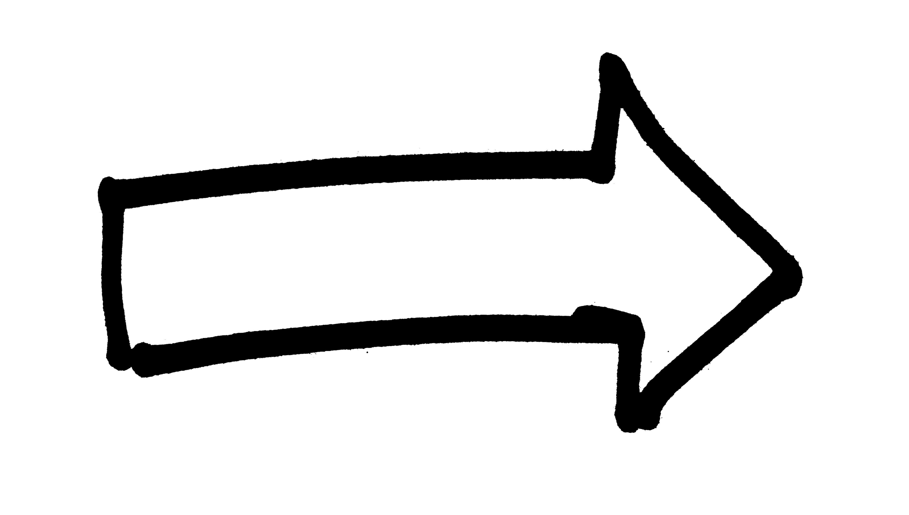

# Artificial Intelligence Nanodegree
## Introductory Project: Diagonal Sudoku Solver

<div align="center">



</div>

#### 4 strategies used in this solver 
##### 1. Eliminate Strategy  
- This is the most basic strategy   
```
    1. There are two possible boxes: already-solved box vs not-solved box
    2. Assign "123456789"  to unsolved boxes
    3. Find already-solved boxes (in which one digit is already assigned)
    4. Loop each "peer" of the solved place and remove the digit from its peers' digits where a peer means a box in the same constraint(row, cols, ...)
```

##### 2. Only Choice Strategy  
- There may be only one possible solution like below case  
  
- Only "1" is possible in the right top of the red square

##### 3. Naked Twins Strategy
- When two boxes have exactly same two possible numbers, it indicates each number should be assigned only to the two boxes (like below we can see `2` or `3` should be assigned to either `F3` or `I3`)
- So, we can remove `2` and `3` from other boxes  
 

##### 4. Depth-First Search  
 - Above strategy may not be enough to solve a sudoku puzzle when there are multiple possible digits
 - First choose a box that has the least possible digits
 - Try with each possible digit in digits and repeat until it's solved


# Question 1 (Naked Twins)
Q: How do we use constraint propagation to solve the naked twins problem?  
A: In *this diagonal sudoku*, there are **four constraints** (rows, columns, square, diagonal), which simply means there should be no duplicate number in each row, column, square, and diagonal. With constraints, we can build a strategy like if one single digit is determined in one box then other boxes in the same row, column, squares, and diagonal should not have that digit. So, a **constraint propagation**  approach is used to solve a sudoku puzzle. It means:  


1. Apply one strategy to eliminate variables (in this case, digits) by checking its constraints
2. With reduced variables from previous step, apply another strategy to reduce more variables
3. Repeat 1-2 until we find a solution

`naked_twin` method searches any possible naked twins (two boxes with same possible digits) and reduces variables faster than when not considering `naked_twins`. Without considering it, the only way to solve it is by searching every possible case, so it improves the performance of this solver as well.


# Question 2 (Diagonal Sudoku)
Q: How do we use constraint propagation to solve the diagonal sudoku problem?  
A: A new constraint, `diagonal_units`, has to be created. What it means here that not only it has to check a constraint in  a row, a column, or a square, it also has to check if the digit of a box is unique along the diagonal. Other than that, it's just like a regualr sudoku. However, it is important to note that there are two diagonal constraints unlike other constraints (there are 9 rows, 9 columns, and 9 squares).

1. diagonal from left-top to right-bottom
2. diagonal from right-top to left-bottom  


### Install

This project requires **Python 3**.
 We recommend students install [Anaconda](https://www.continuum.io/downloads), a pre-packaged Python distribution that contains all of the necessary libraries and software for this project.
Please try using the environment we provided in the Anaconda lesson of the Nanodegree.

##### Optional: Pygame

Optionally, you can also install pygame if you want to see your visualization. If you've followed our instructions for setting up our conda environment, you should be all set.

If not, please see how to download pygame [here](http://www.pygame.org/download.shtml).

### Code

* `solutions.py` - You'll fill this in as part of your solution.
* `solution_test.py` - Do not modify this. You can test your solution by running `python solution_test.py`.
* `PySudoku.py` - Do not modify this. This is code for visualizing your solution.
* `visualize.py` - Do not modify this. This is code for visualizing your solution.


### Additional Codes
* `solver.py` - Run & Analyze multiple sudoku puzzles. Example of this looks like this (measured in seconds):  

> min_time: 0.04237818717956543  
> max_time: 8.132559061050415  
> avg_time: 0.501680519580841  
> rate: 1.0  

* `test_solver.py` - Unittest for `solver.py`
* [`/data/easy1011.txt`](https://github.com/kkweon/sudoku-solver/blob/master/data/easy1011.txt) - Easy Sudoku Puzzles of 1,011.
* [`/data/hard2365.txt`](https://github.com/kkweon/sudoku-solver/blob/master/data/hard2365.txt) - Hard Sudoku Puzzles of 2,365.


### Visualizing

To visualize your solution, please only assign values to the values_dict using the ```assign_values``` function provided in solution.py

### Data

The data consists of a text file of diagonal sudokus for you to solve.
